# 🐟 Sapu Sapu Tracker

**Sapu Sapu Tracker** adalah aplikasi berbasis mobile (Flutter) yang dirancang untuk memantau, mendata, dan memetakan persebaran spesies invasif (Ikan Sapu-Sapu) di berbagai wilayah perairan. Aplikasi ini memungkinkan masyarakat (*citizen science*) untuk berpartisipasi aktif dalam pelaporan temuan ikan sapu-sapu secara *real-time*.

## ✨ Fitur Utama
- **Autentikasi Mudah:** Login yang cepat dengan integrasi Google Sign-In.
- **Pelaporan Berbasis Lokasi (Geotagging):** Mendeteksi koordinat GPS secara otomatis dan mengubahnya menjadi alamat teks (*Reverse Geocoding*) saat pengguna membuat laporan.
- **Peta Interaktif:** Melihat sebaran laporan di peta dengan penanda khusus (*custom marker*) dan popup detail lokasi.
- **Dashboard Statistik:** Visualisasi data temuan (Top Kecamatan, Distribusi per Kota dan Provinsi) menggunakan *Donut Chart* dan *Progress Bar*.
- **Sistem Moderasi Admin:** Admin dapat menyetujui atau menolak laporan masuk (*pending*) sebelum ditampilkan secara publik di peta dan statistik.
- **Riwayat Pelaporan:** Pengguna dapat melacak status laporan yang telah mereka ajukan (Menunggu, Disetujui, atau Ditolak).

---

## 📸 Antarmuka Aplikasi (Screenshots)

### 1. Autentikasi & Onboarding
| Halaman 1 Login | Halaman 2 Login | Halaman 3 Login |
|:---:|:---:|:---:|
| 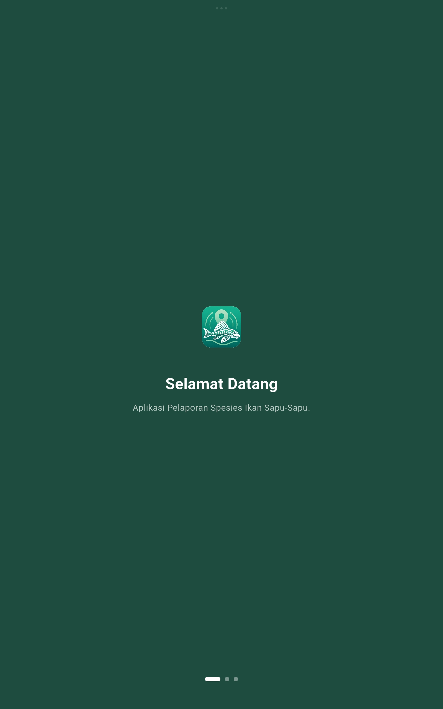 | 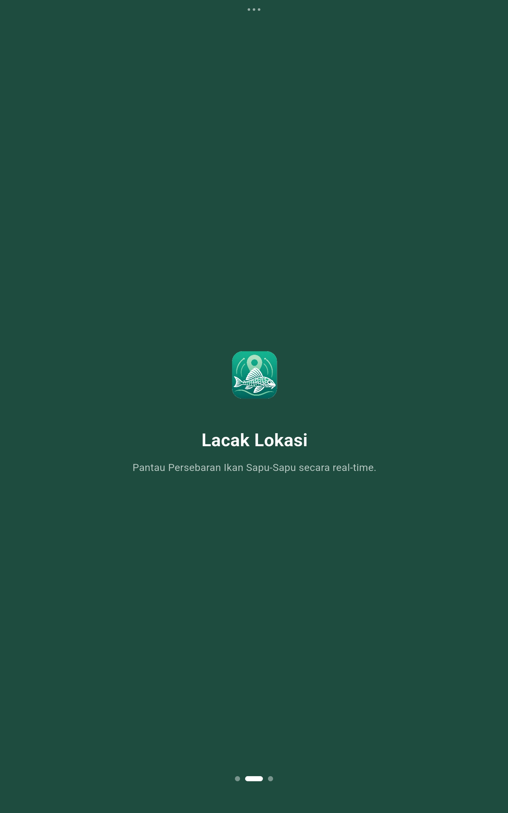 | 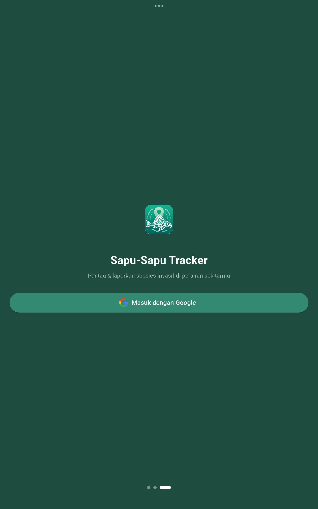 |

### 2. Beranda & Peta Persebaran
| Home | Peta | Zoom In Peta |
|:---:|:---:|:---:|
| 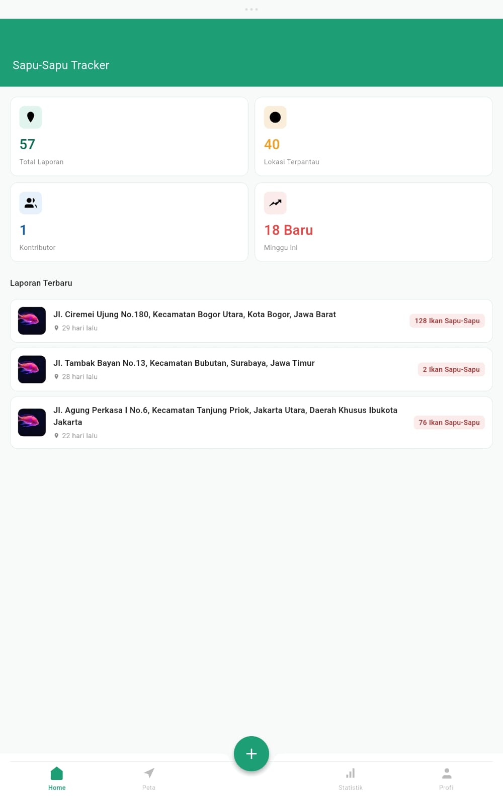 | 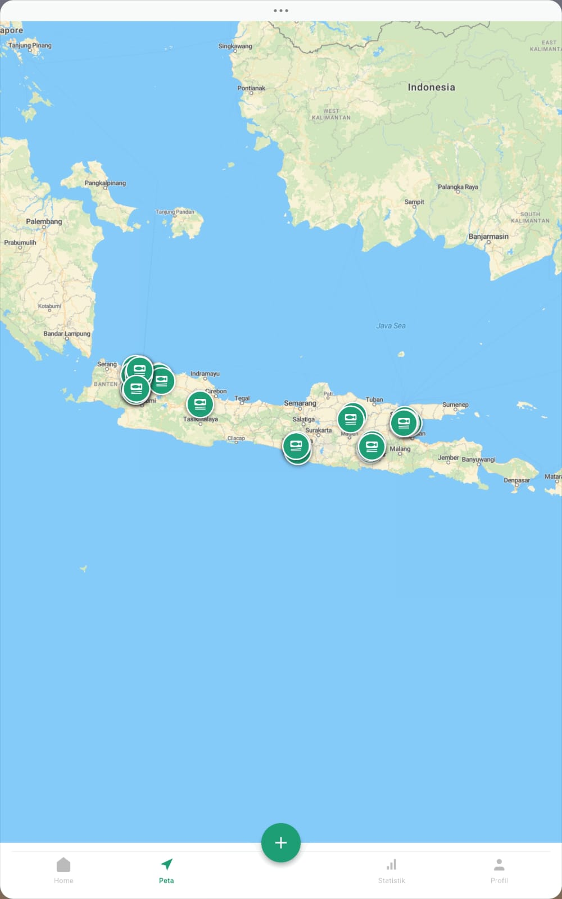 | 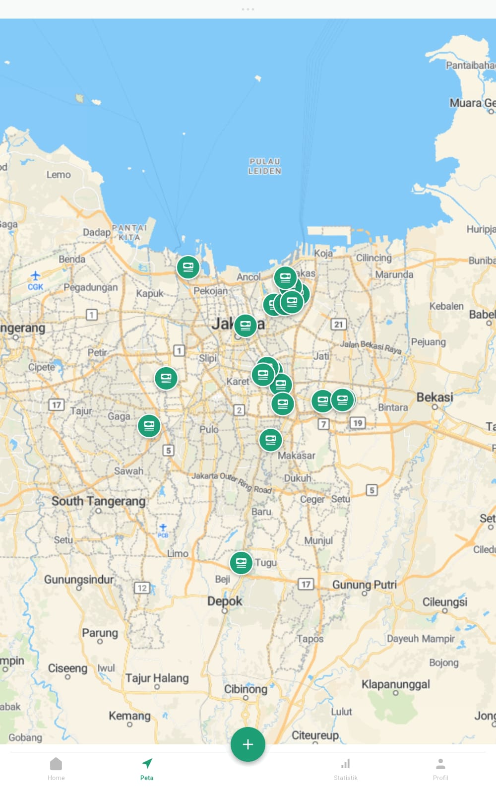 |

**Detail Pelaporan pada Peta:**
<br>
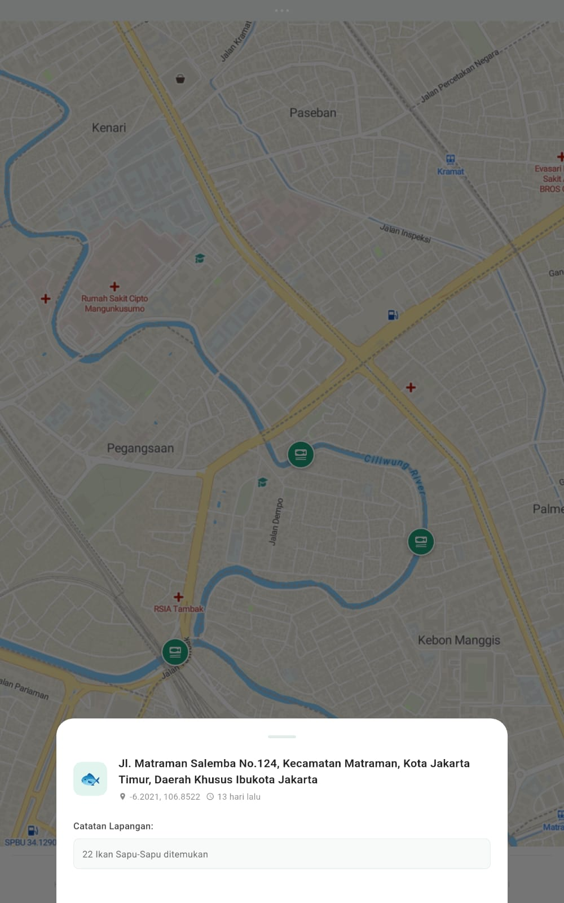

### 3. Alur Pelaporan (Report)
| Ajukan Pelaporan | Isi data-data untuk Ajukan Pelaporan |
|:---:|:---:|
| 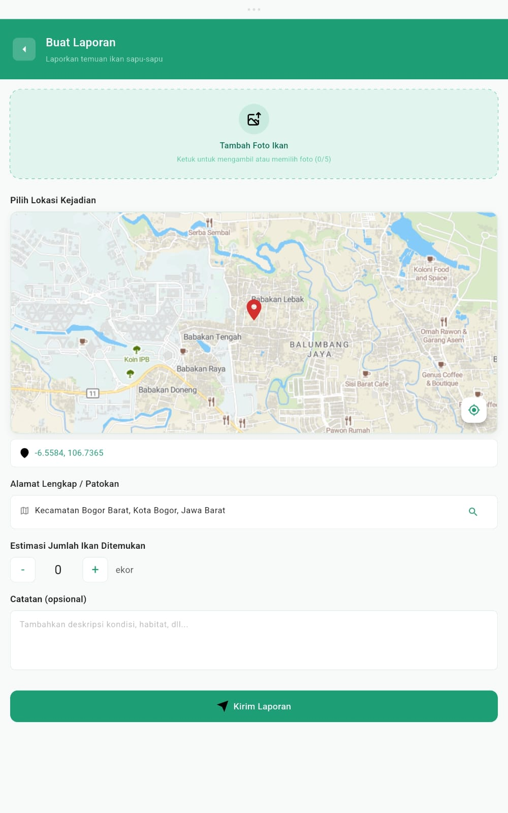 | 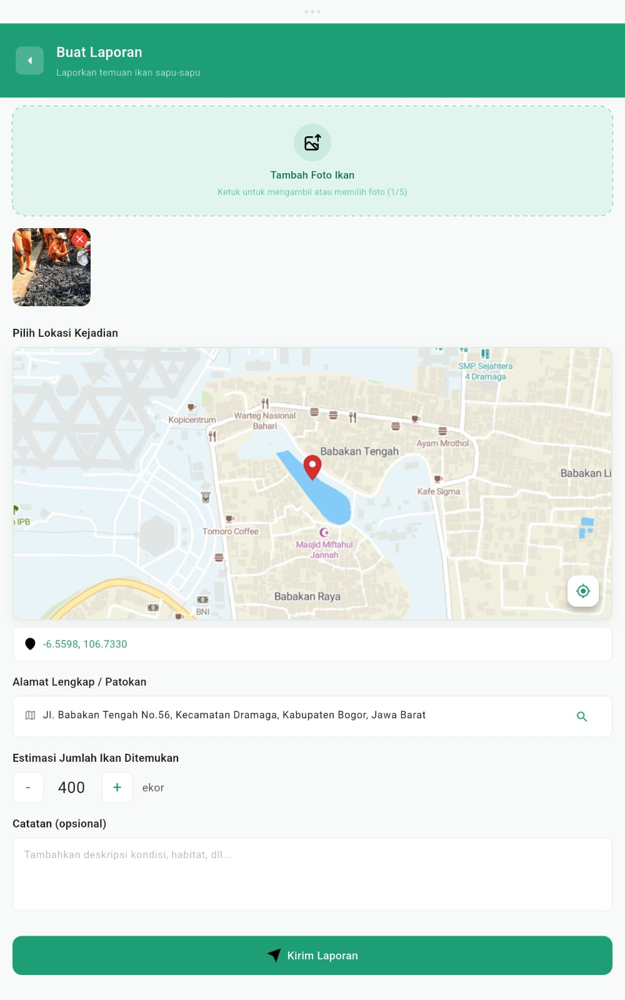 |

### 4. Analisis & Profil
| Statistik | Profile | Edit Profile |
|:---:|:---:|:---:|
| 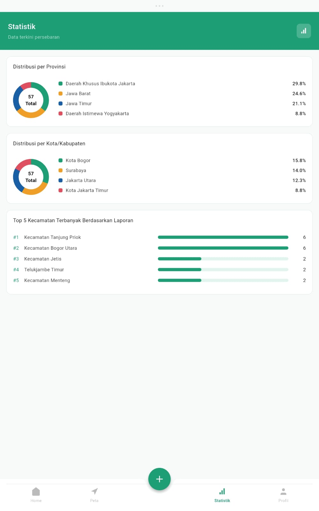 | 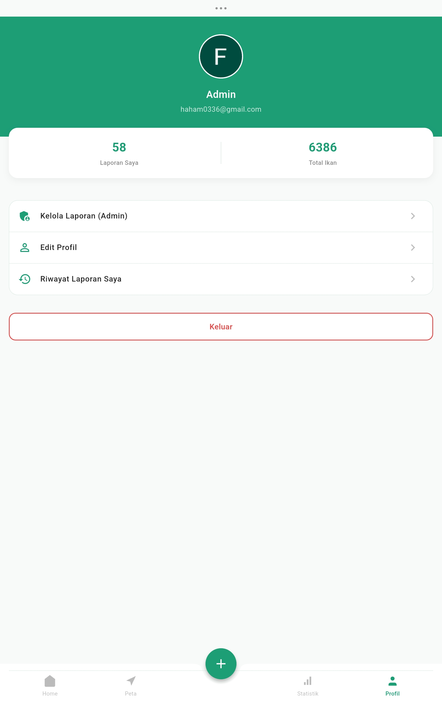 |  |

### 5. Manajemen Laporan
| Riwayat Laporan Saya | Kelola Laporan (Admin) | Logout |
|:---:|:---:|:---:|
| 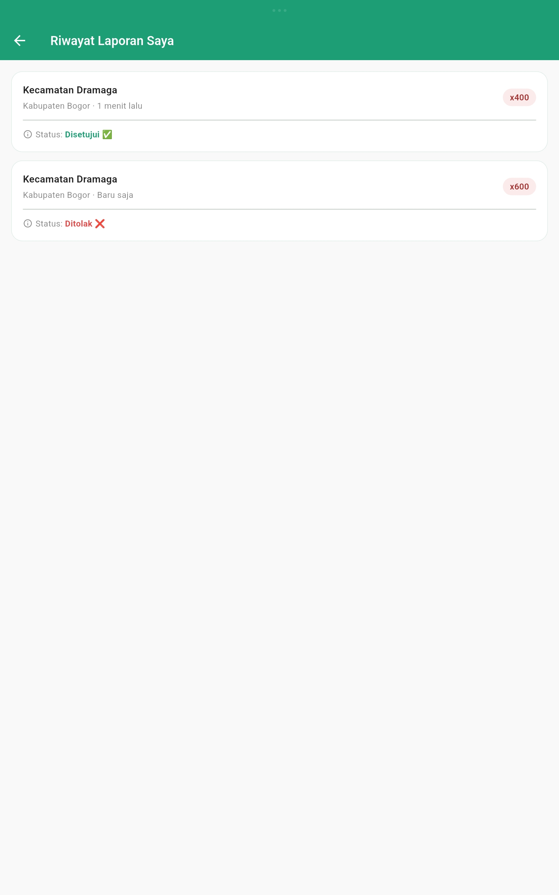 | 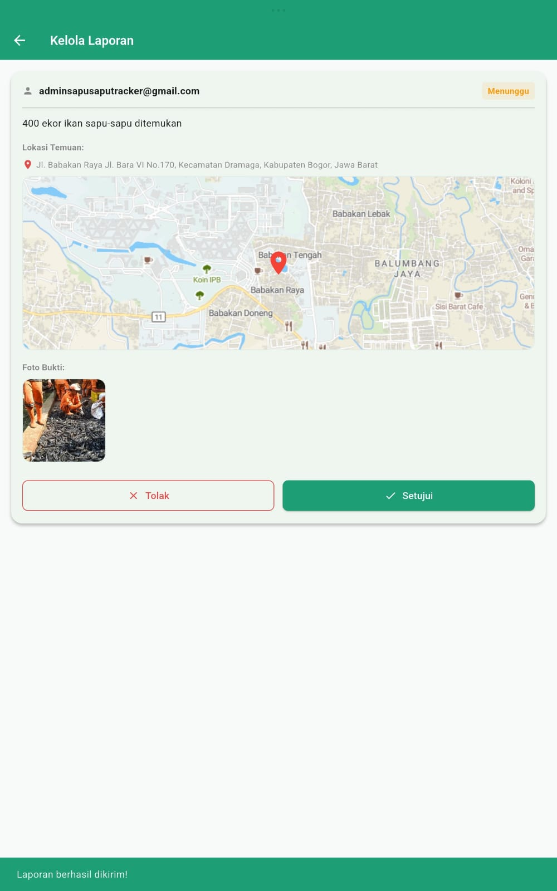 | 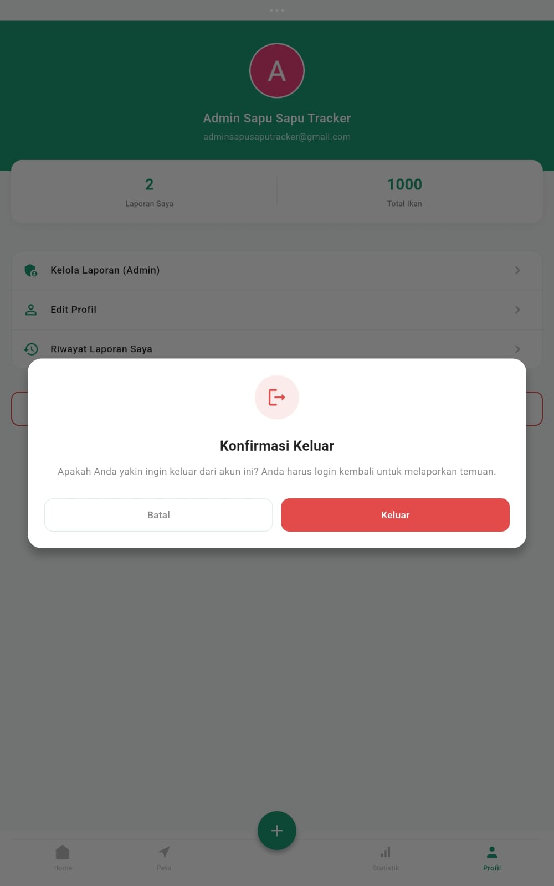 |

---

## 🛠️ Teknologi yang Digunakan
- **Frontend:** Flutter (Dart)
- **Backend (BaaS):** Firebase (Firestore, Auth) & Supabase (Storage)
- **Maps:** `flutter_map` dengan *MapTiler API*
- **Geolokasi:** `geolocator` & `geocoding`

## 🚀 Cara Menjalankan Project Secara Lokal

1. Clone repository ini:
   ```bash
   git clone -b sapu-v2 https://github.com/kenneth2010leo/sapu_sapu_tracker_app.git
   ```
2. Masuk ke direktori project:
   ```bash
   cd sapu_sapu_tracker_app
   ```
3. Unduh semua dependencies:
   ```bash
   flutter pub get
   ```
4. Atur Environment Variables (Kunci Rahasia):
   - Duplikat file `.env.example` dan ubah namanya menjadi `.env`.
   - Isi `SUPABASE_URL`, `SUPABASE_ANON_KEY`, dan `MAPTILER_API_KEY` sesuai dengan kredensial milik Anda.
5. Jalankan aplikasi di device/emulator:
   ```bash
   flutter run
   ```

## 📦 Cara Membangun (Build) APK untuk Android
Jika Anda ingin membagikan aplikasi ini kepada teman atau dosen agar bisa langsung di-install di HP Android mereka, ikuti langkah ini:

1. Buka terminal di VS Code (pastikan Anda berada di direktori `sapu_sapu_tracker_app`).
2. Jalankan perintah build APK:
   ```bash
   flutter build apk --release
   ```
3. Tunggu proses *compiling* selesai (bisa memakan waktu beberapa menit).
4. Jika berhasil, file APK Anda akan tersimpan secara otomatis di dalam folder:
   `build/app/outputs/flutter-apk/app-release.apk`
5. Kirim file `app-release.apk` tersebut via WhatsApp/Google Drive ke HP Android untuk di-install.

---
*Aplikasi ini dikembangkan untuk mendukung upaya monitoring ekosistem perairan dari spesies invasif.*
